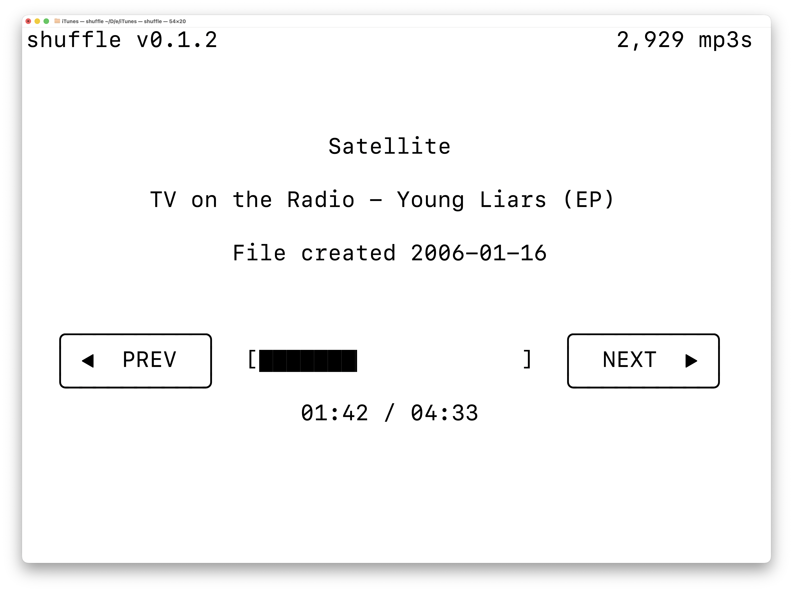

# shuffle

```bash
brew install ddnn55/tap/shuffle
```

`shuffle` is a terminal MP3 player for macOS.

It scans a folder for `.mp3` files, plays them shuffled or sorted, and provides a simple TUI with keyboard and mouse controls.



The iOS app in this repository is experimental and is not part of the Homebrew distribution.

## Features

- Shuffle playback across a folder of MP3s, or sorted playback by artist, album, and track number
- Track metadata display from ID3 tags when available
- Previous/next controls
- Play/pause support
- Resume previous track and position on relaunch
- macOS media remote integration

## Requirements

- macOS
- Homebrew for the packaged install
- Rust toolchain for source builds

The main player is implemented in Rust and uses native macOS media APIs for system media integration.

## Install

```bash
brew install ddnn55/tap/shuffle
```

Update an existing install with:

```bash
brew reinstall --force-bottle ddnn55/tap/shuffle
```

## Run From Source

```bash
cargo run --release -- /path/to/music-folder
```

If you omit the path, `shuffle` scans the current directory for MP3 files.

## Controls

- `space`: play/pause
- `left` or `h`: previous track
- `right` or `l`: next track
- click `SHUF ON` / `SHUF OFF`: toggle shuffle
- `q` or `esc`: quit

## Usage

After installing:

```bash
shuffle /path/to/music-folder
```

Use `--no-shuffle` to play sorted by artist, album, then track number. Use `--shuffle` to force shuffled playback.

The Homebrew formula installs only the `shuffle` command-line tool.

## State

Playback state is stored at:

```text
~/.shuffle/state
```
